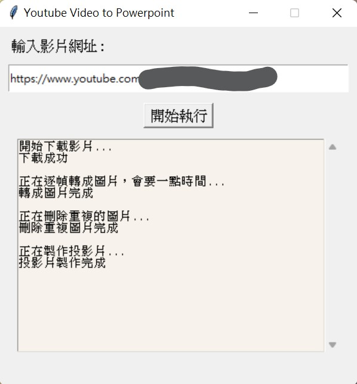

# Change Youtube video to powerpoint

Execute the file and copy the address to the text bar

Necessary python packages :

1. pytube (for downloading youtube video)
2. python-pptx (for making ppt file)
3. python-opencv (for detecting and deleting redundant frames)

Necessary software :
FFmpeg (open source free software) - https://www.wikihow.com/Install-FFmpeg-on-Windows
